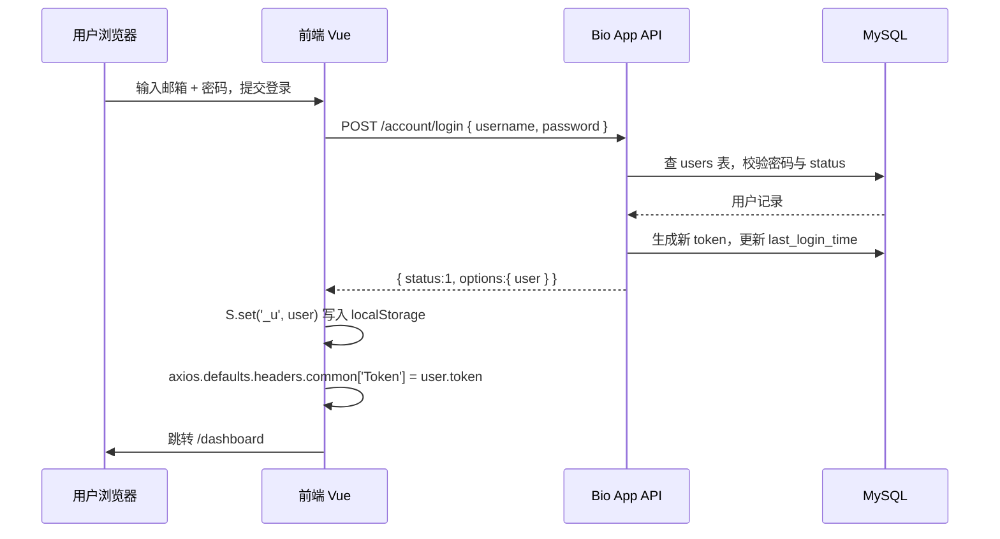

# 标准元件库 Online — 项目交接说明

> 交接日期：2026-07-09  
> 代码仓库：`git@github.com:berserker001/bio-app.git`  
> 当前分支：`main`（最近提交：`e9aefcd` 初始化数据库）  
> 签收确认：[acceptance.md](./acceptance.md)

---

## 1. 项目概述

**标准元件库 Online**（Bio App）是一套面向合成生物学元件库管理的 Web 应用，提供用户账户体系、元件数据集浏览与维护、生物信息学工具（T-Pro / TPlot）集成、任务管理、文件存储、文档中心及后台管理等功能。

系统采用前后端分离架构：

| 层级 | 技术栈 | 默认端口 |
|------|--------|----------|
| 前端 | Vue 3 + Vite + Vant + SCSS | 8090（开发） |
| 后端 API | Express 5 + Prisma 7 | 9092 |
| 数据库 | MySQL / MariaDB | 3306 |

前端通过 `/api/` 代理访问后端，通过 `/t-pro-api/` 代理访问 T-Pro 计算服务。

---

## 2. 目录结构说明

```
bio-app/
├── index.html                  # 前端入口 HTML
├── vite.config.js              # Vite 配置（开发代理、端口）
├── package.json                # 前端依赖与脚本
├── labdnadata.sql.zip          # 遗留元件库初始数据（可选导入）
│
├── readmes/                    # 项目文档
│   ├── delivery.md             # 本交接说明（含 §11 前端 API 清单）
│   ├── api-examples.md         # 前端全部接口请求与响应示例
│   ├── deploy-webserver.md     # Nginx / Apache 生产部署指南
│   ├── acceptance.md           # 签收确认书
│   └── unfinished.md           # 待完善事项记录
│
├── public/                     # 前端静态资源（构建时原样复制）
│   ├── images/                 # 页面插图、图标、分类 Banner
│   ├── fonts/                  # Exo 字体文件
│   └── templates/tpro/         # T-Pro 上传模板（CSV / TXT）
│
├── src/                        # 前端源码
│   ├── main.js                 # 应用入口（挂载 Vue、注册全局库）
│   ├── App.vue                 # 根组件（路由守卫、axios 实例）
│   ├── router/index.js         # 路由表（Hash 模式，20+ 页面）
│   ├── assets/
│   │   ├── css/main.scss       # 全局样式（约 5800 行）
│   │   └── js/                 # 工具库（i18n、分页、T-Pro 辅助、第三方压缩包）
│   ├── data/                   # 前端 Mock / 静态数据（部分页面尚未对接 API）
│   └── components/             # 页面与子组件（按业务模块分子目录）
│       ├── admin.vue           # 后台管理（单文件大组件）
│       ├── dashboard/          # 仪表盘
│       ├── dataset-browse/     # 元件浏览（正式投产）
│       ├── datasets/           # 分类卡片子组件（categories-part-card）
│       ├── datasets-legacy/    # 早期原型，未投产
│       ├── datatable-config/   # 早期原型，未投产
│       ├── document/           # 文档中心
│       ├── modals/             # T-Pro 操作弹窗、物种管理等
│       ├── parts/              # 公共部件（侧栏菜单、分页、编辑器等）
│       ├── settings/           # 账户设置卡片
│       ├── sharing/            # 共享
│       ├── t-pro/results/      # T-Pro 任务结果展示
│       ├── tplot/              # TPlot 面板组件
│       └── --unused/           # 已废弃、未引用的组件
│
└── api/                        # 后端 API 服务
    ├── package.json            # 后端依赖与脚本
    ├── .env.example            # 环境变量模板
    ├── prisma.config.ts        # Prisma 7 配置
    ├── prisma/
    │   ├── schema.prisma       # 数据库模型（平台表 + 遗留元件库表）
    │   └── migrations/         # 迁移目录（当前为空，建议自行补全）
    ├── scripts/
    │   └── migrate-content-to-html.js  # 文档内容迁移脚本
    ├── res/                    # 运行时文件存储（需持久化、需写权限）
    │   ├── avatars/            # 用户头像
    │   └── user-files/         # 用户上传文件（按 user_id 分子目录）
    ├── tmp/uploads/            # 数据集上传临时目录
    └── src/
        ├── server.js           # Express 入口、路由挂载、CORS
        ├── constants/          # 角色常量等
        ├── middleware/         # 认证（auth）、上传（multer）
        ├── lib/                # 响应封装、日期、排序等工具
        ├── utils/              # 文档 HTML 转换等
        ├── data/               # 数据集浏览初始配置数据
        ├── routes/             # REST 路由（按模块拆分，见 §9）
        └── services/           # 业务逻辑与数据访问层
```

### 2.1 根目录文件

| 路径 | 说明 |
|------|------|
| `index.html` | SPA 入口；含语言检测（`zh-cn` / `en-us`）、全局文件选择器 |
| `vite.config.js` | 开发服务器端口 `8090`；代理 `/api`、`/t-pro-api`、`/res` 等 |
| `package.json` | 前端 `dev` / `build` / `serve` 脚本 |
| `labdnadata.sql.zip` | 遗留元件库 SQL 备份，用于初始化 `parttable` 等表数据 |

### 2.2 前端 `src/` 要点

| 路径 | 说明 |
|------|------|
| `router/index.js` | 所有页面路由定义；默认重定向至 `/dashboard` |
| `assets/css/main.scss` | 全站 UI 样式，覆盖侧栏、表格、弹窗、后台等 |
| `assets/js/common.js` | 全局工具函数、用户状态 `G.U`、页面跳转等 |
| `data/*.js` | Mock / 静态选项；TPlot 部分面板下拉 fallback、早期 datasets 原型页面仍引用 |
| `components/parts/app-menu.vue` | 左侧导航栏（含全局搜索、Admin 入口） |
| `components/admin.vue` | 后台管理主页面（用户 / 文件 / 任务 / 应用 / 文档 / 设置） |

**页面组件与路由对应关系：**

| 组件文件 | 路由 |
|----------|------|
| `dashboard.vue` | `/dashboard` |
| `apps.vue` | `/apps` |
| `t-pro.vue` | `/t-pro` |
| `tplot.vue` | `/tplot` |
| `tasks.vue` / `task-detail.vue` | `/tasks`、`/tasks/:id` |
| `sharing.vue` | `/sharing` |
| `files.vue` | `/files` |
| `datasets-categories.vue` | `/datasets-categories`（侧栏 Database 入口） |
| `dataset-browse.vue` | `/datasets/:id/browse` |
| `dataset-item-detail.vue` / `dataset-item-edit.vue` | `/datasets/:type/:id/detail`、`/edit`（browse 子链路） |
| `datasets.vue` / `datasets-legacy.vue` / `datatable-config.vue` / `item-detail.vue` | `/datasets`、`/datasets-legacy`、`/datasets/:id/config`、`/item-detail/:id`（**早期原型，Mock，未投产**） |
| `document.vue` | `/document` |
| `search.vue` | `/search` |
| `notifications.vue` | `/notifications` |
| `settings.vue` | `/settings` |
| `signin.vue` / `signup.vue` | `/signin`、`/signup` |
| `admin.vue` | `/admin` |

### 2.3 后端 `api/src/` 要点

| 路径 | 说明 |
|------|------|
| `server.js` | 启动入口；挂载 15 组路由，默认端口 `9092` |
| `middleware/auth.js` | `requireUser` / `requireAdmin` 鉴权 |
| `middleware/uploadMulter.js` | 数据集上传中间件 |
| `services/db.js` | Prisma 客户端初始化 |
| `services/userStore.js` | 用户 CRUD、密码哈希（pbkdf2） |
| `services/seedData.js` | 应用、文档、用户初始数据种子 |
| `services/datasetBrowseStore.js` | 元件浏览核心逻辑（Part / Backbone / Plasmid） |
| `services/tproService.js` | T-Pro 外部 API 封装 |
| `services/taskRunner.js` | 异步执行 T-Pro 任务并写回结果 |
| `services/userFileStore.js` | 用户文件存储、配额管理 |
| `services/mailService.js` | SMTP 邮件发送 |
| `routes/admin.js` | 后台管理全套接口（体量最大） |

### 2.4 运行时与构建产物（通常不纳入 Git）

| 路径 | 说明 |
|------|------|
| `node_modules/` | 前端依赖（`npm install` 生成） |
| `api/node_modules/` | 后端依赖 |
| `dist/` | 前端生产构建输出（`npm run build`） |
| `api/res/` | 用户上传文件、头像（生产需备份） |
| `api/tmp/` | 上传临时文件（可定期清理） |
| `api/.env` | 本地环境变量（含数据库密码、SMTP 等敏感信息） |

---

## 3. 交接范围

### 3.1 交付物清单

| 类别 | 路径 / 说明 | 备注 |
|------|-------------|------|
| 前端源码 | `src/`、`index.html`、`vite.config.js`、`package.json` | 含 20+ 页面组件 |
| 后端源码 | `api/src/`、`api/package.json` | Express REST API |
| 数据库模型 | `api/prisma/schema.prisma` | 含用户体系 + 元件库遗留表 |
| 环境变量模板 | `api/.env.example` | 需复制为 `api/.env` 并填写 |
| 本地开发启动文档 | `README.md` | 依赖安装、环境配置、本地启动步骤 |
| 前端 API 清单 | `readmes/delivery.md` §11 | 前端实际调用的 `/api`、T-Pro、TPlot、LabDatabase 接口 |
| 前端接口示例 | `readmes/api-examples.md` | 前端实际调用的全部接口请求与响应示例 |
| 静态资源 | `public/`（图片、字体、模板） | 前端公共资源 |
| 用户上传目录 | `api/res/`（avatars、user-files） | 运行时生成，需持久化 |
| 数据迁移脚本 | `api/scripts/migrate-content-to-html.js` | 文档内容 JSON → HTML 迁移 |
| 构建产物 | `dist/`（执行 `npm run build` 生成） | 当前未纳入 Git |

### 3.2 不在本次交接范围内

- Docker / CI/CD 流水线配置（仓库内未提供，需甲方自行搭建）
- Nginx / Apache 生产部署：见 [deploy-webserver.md](./deploy-webserver.md)
- T-Pro 计算服务源码（外部服务，仅通过 HTTP 接口调用）
- 自动化测试用例
- 生产环境域名、SSL 证书、服务器运维
- `node_modules/`、`dist/`（需本地安装 / 构建）

---

## 4. 功能模块清单

### 4.1 用户与权限

| 功能 | 路由 | 后端接口 | 状态 |
|------|------|----------|------|
| 登录 / 注册 / 登出 | `/signin`、`/signup` | `/account/*` | ✅ 已对接 API |
| 找回密码（邮箱验证码） | 弹窗组件 | `/account/sendVCode`、`/account/resetPassword` | ✅ 需配置 SMTP |
| 个人资料编辑 | `/settings` | `/user/updateProfile`、`/user/uploadAvatar` | ✅ |
| 修改密码 / 邮箱 | `/settings` | `/user/changePassword`、`/user/changeEmail` | ✅ |
| 角色体系 | — | — | 普通用户(0) / 数据管理员(1) / 管理员(9) |

### 4.2 核心业务模块

| 模块 | 路由 | 说明 | 数据来源 |
|------|------|------|----------|
| Dashboard | `/dashboard` | 应用快捷入口、通知、待办、任务统计、存储用量 | API |
| 应用中心 | `/apps` | 应用列表、收藏 | API |
| T-Pro | `/t-pro` | 启动子/预测子/文库设计/转录调控优化等计算任务 | 外部 T-Pro API + 本地任务记录 |
| TPlot | `/tplot` | 二聚体绘图、拟合、组装、优化面板 | 外部 TFDesignWeb（`/tplot-api`）+ WebDatabase；部分下拉选项仍有 Mock fallback |
| 任务管理 | `/tasks`、`/tasks/:id` | 创建、查看、删除、共享任务 | API |
| 共享中心 | `/sharing` | 查看被共享任务、取消共享 | API |
| 文件管理 | `/files` | 上传、下载、删除、配额查询 | API + 本地磁盘 |
| 全局搜索 | `/search` | 搜索任务、元件、文件、文档 | API |
| 通知中心 | `/notifications` | 列表、标记已读 | API |
| 文档中心 | `/document` | 分章节帮助文档浏览 | API（支持后台编辑） |

### 4.3 数据集（DataSets）

> **投产说明：** 侧栏 Database 入口仅指向 `datasets-categories` → `dataset-browse` 链路。其余 datasets 相关页面（`/datasets`、`/datasets-legacy`、`/datasets/:id/config`、`/item-detail/:id`）为早期原型，使用 Mock 数据，路由仍注册但未接入导航，**最终未投入生产**。详情见 [unfinished.md](./unfinished.md)。

**正式投产链路：**

| 步骤 | 路由 | 组件 | 数据来源 |
|------|------|------|----------|
| 分类入口 | `/datasets-categories` | `datasets-categories.vue` | 组件内硬编码分类卡片 |
| 元件浏览 | `/datasets/:id/browse` | `dataset-browse.vue` | API（遗留 DB 表）；筛选元数据部分仍引用 Mock |
| 详情 / 编辑 | `/datasets/:type/:id/detail`、`/edit` | `dataset-item-detail.vue`、`dataset-item-edit.vue` | API |
| 批量上传 | 浏览页弹窗 | `dataset-batch-upload-modal.vue` 等 | API（本地 `xlsx` + Prisma） |

> **Logic Gates & Circuits** 分类卡片当前为 `disabled`，不可点击进入。

### 4.4 后台管理（Admin Panel）

仅 `role >= 9` 的管理员可见，路由 `/admin`。

| Tab | 功能 |
|-----|------|
| Users | 用户列表、启用/禁用、角色分配、存储配额、细粒度权限 |
| Files | 全站文件浏览、按条件批量清理 |
| Tasks | 全站任务浏览、状态修改、删除 |
| Apps | 应用 CRUD、排序、上下架 |
| Documents | 文档章节 / 页面 CRUD（富文本 HTML） |
| Settings | 系统键值配置管理 |

所有操作均记录审计日志（`admin_audit_logs` 表）。

---

## 5. 技术版本清单

### 5.1 运行环境

| 组件 | 推荐版本 | 说明 |
|------|----------|------|
| Node.js | ≥ 18（开发环境 v22.22.3） | 前后端均需 |
| MySQL / MariaDB | 5.7+ / 10.x | Prisma `provider = "mysql"` |
| npm | 随 Node 自带 | 包管理 |

### 5.2 前端依赖（`package.json`）

| 包名 | 版本 | 用途 |
|------|------|------|
| vue | ^3.2.8 | 核心框架 |
| vue-router | ^4.5.1 | 路由（Hash 模式） |
| vite | ^2.5.2 | 构建工具 |
| vant | ^4.9.21 | 移动端 UI 组件 |
| axios | ^1.11.0 | HTTP 客户端 |
| @wangeditor/editor | ^5.1.23 | 富文本编辑器（后台文档） |
| date-fns | ^4.1.0 | 日期处理 |
| floating-vue | ^5.2.2 | 悬浮提示 |
| sass | ^1.86.0 | 样式预处理 |

项目版本号：`0.0.0`

### 5.3 后端依赖（`api/package.json`）

| 包名 | 版本 | 用途 |
|------|------|------|
| express | ^5.2.1 | Web 框架 |
| @prisma/client | ^7.8.0 | ORM 客户端 |
| prisma | ^7.8.0 | Schema 与迁移工具 |
| @prisma/adapter-mariadb | ^7.8.0 | MariaDB 适配器 |
| mariadb | ^3.5.3 | 数据库驱动 |
| multer | ^2.2.0 | 文件上传 |
| nodemailer | ^7.0.5 | 邮件发送 |
| dotenv | ^17.4.2 | 环境变量 |

项目版本号：`1.0.0`

### 5.4 外部服务依赖

| 服务 | 默认地址 | 环境变量 | 说明 |
|------|----------|----------|------|
| T-Pro API | 由 `TPRO_API_URL` 配置 | `TPRO_API_URL` | 启动子计算、资源注册等 |
| T-Pro 物种接口 | 开发代理 `/t-pro-api/` | vite.config.js 配置 | 物种列表、资源管理 |
| SMTP 邮件 | `smtp.163.com:465` | `SMTP_*` | 注册验证码、找回密码 |

---

## 6. 第三方依赖与开源许可证

> **免责声明**：以下信息基于 `package.json` 声明及已安装版本的 `license` 字段整理，供甲方合规参考；**不构成法律意见**。生产发布前建议由法务或合规团队复核，并运行 `npx license-checker --production` 生成完整传递依赖清单。

### 6.1 许可证合规总览

| 类别 | 数量（直接依赖） | 主要许可证类型 | 商业使用 |
|------|------------------|----------------|----------|
| 前端 npm 依赖 | 14 项 | MIT 为主 | ✅ 一般无额外授权费 |
| 前端内嵌 JS 库 | 5 项 | MIT / Apache-2.0 | ✅ 需保留版权声明 |
| 后端 npm 依赖 | 8 项 | MIT / Apache-2.0 / LGPL | ⚠️ 见 6.5 节 |
| 数据库与运行时 | 2 项 | GPL / MIT（视组件而定） | ⚠️ 见 6.6 节 |
| 外部专有服务 | 1 项 | 商业服务协议 | ❌ 非开源，需单独签约 |

**通用合规义务（所有宽松许可证）：**

- 分发构建产物（`dist/`）或交付源码时，应在文档或 `NOTICE` 文件中保留各依赖的版权声明与许可证全文。
- 不得移除源码或压缩包中的原有 License 头信息。
- 本项目业务代码版权归项目交付方 / 甲方（以合同约定为准），与第三方库许可相互独立。

### 6.2 前端 npm 直接依赖

| 包名 | 安装版本 | 许可证 | 用途 | 商业授权限制 | 潜在替代方案 |
|------|----------|--------|------|--------------|--------------|
| vue | 3.5.x | MIT | 核心框架 | 无 | React（MIT）、Svelte（MIT） |
| vue-router | 4.5.x | MIT | 路由 | 无 | — |
| vant | 4.9.x | MIT | UI 组件库 | 无 | Element Plus（MIT）、Naive UI（MIT） |
| @vant/touch-emulator | 1.4.x | MIT | 桌面端触摸模拟 | 无 | — |
| axios | 1.11.x | MIT | HTTP 客户端 | 无 | fetch（内置）、ky（MIT） |
| @wangeditor/editor | 5.1.x | MIT | 富文本编辑器核心 | 无 | TipTap（MIT）、Quill（BSD-3） |
| @wangeditor/editor-for-vue | 5.1.x | MIT | WangEditor Vue 封装 | 无 | 同上 |
| date-fns | 4.1.x | MIT | 日期格式化 | 无 | dayjs（MIT）、Luxon（MIT） |
| floating-vue | 5.2.x | MIT | 悬浮提示 / Popover | 无 | @floating-ui/vue（MIT） |
| vite | 2.9.x | MIT | 开发与构建 | 无 | Webpack（MIT）、esbuild（MIT） |
| @vitejs/plugin-vue | 1.10.x | MIT | Vue SFC 编译插件 | 无 | — |
| @vue/compiler-sfc | 3.5.x | MIT | 单文件组件编译器 | 无 | — |
| sass | 1.90.x | MIT | SCSS 编译（Dart Sass） | 无 | Less（Apache-2.0） |
| http-proxy-middleware | 3.0.x | MIT | 开发环境反向代理 | 无 | 生产环境用 Nginx |

### 6.3 前端内嵌第三方库（`src/assets/js/`）

以下库以压缩文件形式直接打包进前端，**不经过 npm 许可证管理**，需单独留存声明：

| 库名 | 文件 | 版本 | 许可证 | 用途 | 商业授权限制 | 潜在替代方案 |
|------|------|------|--------|------|--------------|--------------|
| jQuery | `jquery-3.6.0.min.js` | 3.6.0 | MIT | DOM 工具（遗留代码） | 无 | 原生 API / 逐步移除 |
| ECharts | `echarts.min.js` | 5.x | Apache-2.0 | Dashboard 图表 | 需保留 NOTICE | Chart.js（MIT） |
| SweetAlert2 | `sweetalert2.min.js` | 11.4.24 | MIT | 弹窗确认 | 无 | 原生 `<dialog>`、Vant Dialog |
| Cropper.js | `cropper.min.js` | 1.5.12 | MIT | 头像裁剪 | 无 | vue-cropper（MIT） |
| Exo 字体 | `public/fonts/` | — | SIL OFL 1.1（Google Fonts 惯例） | 界面字体 | 可自由嵌入网页 | Inter（OFL）、系统字体栈 |

### 6.4 后端 npm 直接依赖

| 包名 | 安装版本 | 许可证 | 用途 | 商业授权限制 | 潜在替代方案 |
|------|----------|--------|------|--------------|--------------|
| express | 5.2.x | MIT | HTTP 框架 | 无 | Fastify（MIT）、Koa（MIT） |
| @prisma/client | 7.8.x | Apache-2.0 | ORM 运行时 | 无（开源版） | mysql2 + 手写 SQL、Knex（MIT） |
| prisma | 7.8.x | Apache-2.0 | Schema / CLI | 无（开源版） | — |
| @prisma/adapter-mariadb | 7.8.x | Apache-2.0 | Prisma MariaDB 驱动适配 | 无（开源版） | — |
| mariadb | 3.5.x | LGPL-2.1-or-later | MariaDB Node 驱动 | ⚠️ 见 6.5 | mysql2（MIT） |
| multer | 2.2.x | MIT | multipart 文件上传 | 无 | busboy（MIT） |
| nodemailer | 7.0.x | MIT-0 | SMTP 邮件 | 无（等同公共领域） | — |
| dotenv | 17.4.x | BSD-2-Clause | 环境变量加载 | 无 | Node 20+ `--env-file` |

### 6.5 需重点关注的许可证

#### mariadb（LGPL-2.1-or-later）

| 项目 | 说明 |
|------|------|
| 风险等级 | 低～中（取决于分发方式） |
| 使用方式 | 作为 npm 依赖在 Node.js 进程中动态加载，**未修改其源码** |
| 合规要点 | 若对外分发包含该驱动的完整应用包，需提供 LGPL 许可声明；若修改了 `mariadb` 包本身，须开放修改部分源码 |
| 建议 | 内部部署通常风险可控；若甲方对 Copyleft 敏感，可替换为 **mysql2**（MIT，API 相近） |
| 替代方案 | `mysql2`（MIT）、`postgres` + `pg`（MIT）配合数据库迁移 |

#### Prisma ORM（Apache-2.0）

| 项目 | 说明 |
|------|------|
| 开源版 | `@prisma/client`、`prisma` CLI 均为 Apache-2.0，**商业使用免费** |
| 付费产品 | Prisma Accelerate、Prisma Pulse、Prisma Optimize 等为 **SaaS 增值服务**，本项目**未使用** |
| 注意 | 仅使用本地 ORM + `prisma db push` / `migrate`，不产生 Prisma 云服务费 |
| 替代方案 | Sequelize（MIT）、TypeORM（MIT）、Drizzle ORM（Apache-2.0） |

#### WangEditor（MIT）及其传递依赖

| 项目 | 说明 |
|------|------|
| 许可证 | 核心包 MIT，传递依赖多为 MIT / BSD |
| 注意 | 编辑器内图片上传等功能依赖 `@uppy/*`（MIT），无商业限制 |
| 替代方案 | TipTap + ProseMirror（MIT）、CKEditor 5（GPL / 商业双许可，**选用需注意**） |

### 6.6 基础设施与运行时许可

| 组件 | 许可证 | 商业使用说明 | 潜在替代方案 |
|------|--------|--------------|--------------|
| Node.js | MIT | 免费，无限制 | Deno（MIT）、Bun（MIT） |
| MySQL Server | GPL-2.0（社区版）/ 商业许可（企业版） | 作为**内部服务端**部署、不修改 MySQL 本身并不分发 MySQL 二进制，社区版通常可接受；对外 SaaS 需法务评估 | MariaDB（GPL-2.0）、PostgreSQL（PostgreSQL License） |
| MariaDB Server | GPL-2.0 | 同上，仅作数据库服务运行时 | PostgreSQL、MySQL 商业版 |
| npm 传递依赖 | 以 MIT / Apache-2.0 / ISC 为主 | 个别传递包可能含 BSD / LGPL，建议发布前扫描 | `license-checker`、`npm audit` |

### 6.7 非开源 / 商业外部依赖

以下组件**不属于开源交付范围**，甲方须自行与提供方确认服务协议、数据合规与费用：

| 服务 | 类型 | 许可 / 协议 | 说明 | 替代方案 |
|------|------|-------------|------|----------|
| T-Pro 计算 API | 专有 Web API | 商业服务协议（非开源） | 启动子预测、资源注册等核心生物计算 | 自建算法服务、更换供应商 API |
| SMTP 邮件服务 | 基础设施 | 邮箱服务商协议 | 163 / 企业邮箱等，授权码非软件许可 | SendGrid、Amazon SES、阿里云邮件 |
| 遗留元件库数据 | 业务数据 | 数据权属归甲方 | `labdnadata.sql.zip` 为业务数据，非软件许可 | — |

### 6.8 许可证扫描建议（甲方接手后）

```bash
# 前端完整依赖树许可证报告
cd /path/to/bio-app
npx license-checker --production --summary

# 后端
cd api
npx license-checker --production --summary

# 导出 JSON 归档备查
npx license-checker --production --json > licenses-frontend.json
```

建议将输出归档至甲方合规文档库，并在每次大版本升级依赖后重新扫描。

---

## 7. 数据库结构概览

Prisma Schema 共 **22 张业务表**，分为三组：

### 7.1 平台表（新建）

`users`、`user_permissions`、`system_settings`、`admin_audit_logs`、`apps`、`user_app_favorites`、`tasks`、`task_shares`、`notifications`、`todos`、`document_sections`、`document_pages`、`user_storage`、`user_files`

### 7.2 遗留元件库表（labdnadata）

`parttable`、`partscartable`、`partfeaturetable`、`partrputable`、`backbonetable`、`backbone_culture_functions`、`backbonescartable`、`backbonefeaturetable`、`plasmidneed`、`plasmid_culture_functions`、`plasmidscartable`、`plasmidfeaturetable`、`parentparttable`、`parentbackbonetable`、`parentplasmidtable`

> 遗留表字段名保持历史命名（如 `PartID`、`uploaddate`），通过 Prisma `@map` 映射。

### 7.3 数据库初始化

```bash
cd api
cp .env.example .env          # 填写 DATABASE_URL
npm install
npx prisma db push            # 或 prisma migrate deploy（若有迁移文件）
npm run prisma:generate
npm start
```

> 注意：当前 `api/prisma/migrations/` 目录为空，建议使用 `prisma db push` 同步 Schema，或自行生成迁移文件。

---

## 8. 环境变量说明

在 `api/.env` 中配置（参考 `api/.env.example`）：

| 变量 | 必填 | 默认值 | 说明 |
|------|------|--------|------|
| `DATABASE_URL` | ✅ | — | MySQL 连接串 |
| `PORT` | — | `9092` | API 监听端口 |
| `SMTP_HOST` | 邮件功能 | `smtp.163.com` | SMTP 服务器 |
| `SMTP_PORT` | — | `465` | SMTP 端口 |
| `SMTP_USER` | ✅（邮件） | — | 发件邮箱 |
| `SMTP_PASS` | ✅（邮件） | — | 授权码（非登录密码） |
| `SMTP_FROM_NAME` | — | `Bio App` | 发件人显示名 |
| `TPRO_API_URL` | T-Pro 功能 | — | T-Pro 服务地址（无默认值，必填） |
| `TOKEN_TTL_MS` | — | `604800000`（7 天） | 登录 Token 有效期（毫秒）；活跃请求滑动续期 |
| `TPRO_REQUEST_TIMEOUT_MS` | — | `600000`（600s） | 后端调用 T-Pro 的请求超时 |
| `TPRO_MAX_CONCURRENCY` | — | `2` | 进程内 T-Pro 任务并发上限 |
| `USER_FILE_STORAGE_DIR` | — | `api/res/user-files` | 用户文件存储根目录 |
| `USER_FILE_MAX_BYTES` | — | 按代码默认 | 单文件大小上限 |
| `DATASET_UPLOAD_TMP_DIR` | — | 系统临时目录 | 上传临时文件 |
| `DATASET_UPLOAD_MAX_BYTES` | — | 按代码默认 | 数据集上传大小上限 |
| `DATASET_UPLOAD_TEMPLATE_DIR` | — | `public/templates` | 上传模板目录 |

---

## 9. 本地开发与部署

> **本地开发启动**：请直接参阅项目根目录 [README.md](../README.md)，其中包含环境要求、数据库配置、前后端启动步骤、首次使用说明及常见问题排查，甲方可按文档独立完成本地环境搭建。

### 9.1 开发启动（摘要）

```bash
# 终端 1 — 后端
cd api && npm install && cp .env.example .env
# 编辑 .env 填写 DATABASE_URL 后：
npm run prisma:db:push && npm run prisma:generate && npm run dev

# 终端 2 — 前端
npm install && npm run dev
```

访问：`http://localhost:8090`（Hash 路由，如 `http://localhost:8090/#/dashboard`）

### 9.2 生产构建

```bash
# 前端
npm run build          # 输出到 dist/

# 后端
cd api && npm start    # 或配合 PM2 / systemd
```

### 9.3 推荐生产部署架构

```
用户浏览器
    ↓
Nginx（静态资源 + 反向代理）
    ├── /          → dist/（前端静态文件）
    ├── /api/      → localhost:9092（Express API）
    ├── /t-pro-api/→ T-Pro 计算服务
    └── /res/      → api/res/（用户上传文件）
```

> `vite.config.js` 中的 `proxy` 配置仅用于开发环境，生产需在 Nginx / Apache 层配置等价代理规则。完整步骤见 [deploy-webserver.md](./deploy-webserver.md)。

---

## 10. 登录鉴权机制

### 10.1 方案概述

本系统采用 **自定义 Token + 请求头传递** 方案，**不使用** Cookie、Session 或 JWT。

| 项目 | 实现方式 |
|------|----------|
| 凭证类型 | 服务端生成的 48 位十六进制随机字符串（`crypto.randomBytes(24).toString('hex')`） |
| 存储位置 | 浏览器 `localStorage`，键名 `_u`，值为完整用户对象 JSON（含 `token`、`token_expires_at`） |
| 传递方式 | 每个 API 请求在 HTTP Header 中携带 `Token: <token值>` |
| 服务端校验 | `api/src/middleware/auth.js` 通过 `users.token` 查库，并校验 `token_expires_at` |
| Token 有效期 | 默认 7 天（`TOKEN_TTL_MS`）；`requireUser` / `refreshProfile` 滑动续期 |
| 密码存储 | PBKDF2（SHA-512，100000 轮）哈希，格式 `pbkdf2:<salt>:<hash>` |

前端 axios 实例定义于 `src/App.vue`：

```javascript
const api = axios.create({ baseURL: '/api/' });
window['axios'] = api;
```

开发环境 `/api/` 由 Vite 代理至 `http://127.0.0.1:9092/`；生产环境由 Nginx 等价转发。

### 10.2 登录流程



**登录成功后的本地状态：**

1. `localStorage['_u']` 保存用户对象（含 `token`、`name`、`email`、`role` 等）
2. 全局响应式对象 `G.U` 同步用户信息
3. 后续所有 `axios` 请求自动附带 `Token` 请求头

### 10.3 会话恢复（应用启动）

`App.vue` 在 `created()` 阶段调用 `userAuth()`：

1. 从 `localStorage['_u']` 读取缓存用户
2. 若存在 `token`，设置 `axios` 默认 Header
3. 调用 `POST /api/user/refreshProfile` 向服务端验证 token 有效性
4. **成功**（`status === 1`）：刷新本地用户数据；若当前在登录/注册页则跳转 Dashboard
5. **失败**（`status === 2`）：跳转 `/signin`

> 无独立 refresh token；会话有效性依赖 `users.token` 存在且未过期。同一 opaque Token 通过滑动续期延长 `token_expires_at`。

### 10.4 Token 刷新与失效

| 场景 | 行为 |
|------|------|
| 滑动续期 | `requireUser` 成功后，若距过期不足一半 TTL，则延长 `token_expires_at`；`refreshProfile` 同样续期 |
| 定时续期 | 前端每小时静默调用 `POST /user/refreshProfile` |
| Token 过期 | `findUserByToken` 清空 token 并返回无效（`status: 2`） |
| 主动登出 | `POST /account/logout` 将 `users.token` / `token_expires_at` 清空；前端 `afterLogout()` 清空会话 |
| 密码修改 | `POST /user/changePassword` 成功后重新签发 token 与过期时间，旧 token 立即失效 |
| 找回密码 | `POST /account/resetPassword` 成功后同样签发新 token |
| 管理员禁用账号 | `users.status` 设为 `0`；下次 `requireUser` 返回 `status: 4` |
| 多设备登录 | 后一次登录会覆盖数据库 token，**前一设备的 token 自动失效**（单 token 策略） |

### 10.5 登出流程

侧栏 `app-menu.vue` 点击退出：

1. `POST /account/logout`（尽力调用，失败不阻塞）
2. `G.afterLogout()`：清空 `G.U`、删除 `axios` Header 中的 `Token`
3. `S.remove('_u')` 或通过 `mirror` 重置字段
4. `router.replace('/signin')`

### 10.6 统一响应状态码（业务层）

后端**绝大多数接口返回 HTTP 200**，通过 JSON 体中的 `status` 字段表达业务结果：

| status | 含义 | 典型场景 |
|--------|------|----------|
| `1` | 成功 | 正常业务响应 |
| `2` | 未登录 / Token 无效 | `requireUser` 查不到用户；登录时账号不存在 |
| `3` | 参数或业务校验失败 | 密码错误、必填项缺失、记录不存在 |
| `4` | 账号禁用或注册字段不全 | `users.status !== 1`；注册缺少 organization |
| `5` | 邮箱格式无效 | 注册 / 改邮箱 |
| `6` | 邮箱已存在 | 注册 / 改邮箱冲突 |
| `0` | 服务端错误或权限不足 | 内部异常；非管理员访问 `/admin` |
| `-99` | 鉴权错误（预留） | 前端拦截器预留，**当前后端未返回此值** |

响应体统一结构：

```json
{
  "status": 1,
  "options": { },
  "msg": ""
}
```

### 10.7 HTTP 401 / 403 与前端处理

**重要：本系统不使用 HTTP 401/403 作为常规鉴权手段。**

| HTTP 状态 | 使用场景 | 前端处理 |
|-----------|----------|----------|
| `200` + `status:2` | Token 无效 / 未登录 | 全局 axios 拦截器清会话并跳转 `/signin`（公开登录类接口除外） |
| `200` + `status:0` + msg | 无管理员权限 | `admin.vue` 显示 Access Denied，不跳转 |
| `200` + `status:4` | 账号被禁用 | 已登录会话由全局拦截器强制登出；登录页映射为 "This client has been disabled..." |
| `404` | 文件下载不存在 | `files.vue` / `search.vue` 提示下载失败 |
| `500` | 下载流异常 | 控制台错误，用户侧提示失败 |
| 网络异常 | axios catch | 各页面 `Swal.fire` 提示 "Network error..." |

前端全局拦截器（`App.vue`）对 `status` 为 `-99` / `2` / `4` 的响应（排除 `account/login|register|sendVCode|resetPassword`）执行强制登出并跳转登录页。

### 10.8 路由守卫

`App.vue` 中 `router.beforeEach` 按路由 `meta` 鉴权：

- `meta.public`（`signin` / `signup`）：未登录可访问；已登录访问则跳转 Dashboard
- 默认路由：无本地会话则跳转 `/signin`
- `meta.requiresAdmin`（`admin`）：`G.U.role < 9` 则跳转 Dashboard

登录/注册页通过 `showAppMenu` 计算属性隐藏侧栏。

### 10.9 角色与接口权限

| role 值 | 标签 | 权限范围 |
|---------|------|----------|
| `0` | 普通用户 | 标准业务接口；只读元件数据 |
| `1` | 数据管理员 | 额外可调用 `datasets/browse/update`、`datasets/browse/delete` |
| `9` | 管理员 | 可访问全部 `/admin/*` 接口；侧栏显示 Admin Panel |

---

## 11. API 清单（前端调用全集）

> 本节按当前前端源码（`src/`）实际调用整理。请求/响应示例见 **[api-examples.md](./api-examples.md)**。  
> **URL 约定：** 下表 URL 为相对 `axios` 实例 `baseURL: '/api/'` 的路径。开发环境完整路径为 `/api/<url>`，经代理后后端实际收到 `/<url>`。  
> **T-Pro 外部接口** 使用独立实例 `tpro`（`baseURL: '/t-pro-api/'`），代理至 T-Pro 计算服务，**非本仓库后端实现**。  
> **TPlot / LabDatabase** 见 §11.11、§11.12，走独立代理或直链，**非本仓库 Express 路由**。

### 11.1 通用约定

| 项目 | 说明 |
|------|------|
| Content-Type | JSON 接口：`application/json`；上传接口：`multipart/form-data` |
| 认证 Header | 除 `account/login`、`account/register`、`account/sendVCode`、`account/resetPassword` 外，均需 `Token` |
| 响应格式 | 见 §10.6；`options` 为业务数据载体 |

### 11.2 账户模块（`/account`）

| 方法 | URL | 用途 | 所属页面 / 组件 | 真实后端 |
|------|-----|------|-------------------|----------|
| POST | `account/login` | 邮箱密码登录 | `signin.vue` | ✅ |
| POST | `account/register` | 新用户注册 | `signup.vue` | ✅ |
| POST | `account/logout` | 登出（清空服务端 token） | `app-menu.vue` | ✅ |
| POST | `account/sendVCode` | 找回密码 — 发送邮箱验证码 | `recover-password-modal.vue` | ✅ |
| POST | `account/resetPassword` | 找回密码 — 验证码 + 新密码 | `recover-password-modal.vue` | ✅ |
| POST | `account/refreshProfile` | 按 token 刷新用户（账户路由版） | 后端存在，前端主要用 `/user/refreshProfile` | ✅ |

### 11.3 用户模块（`/user`）

| 方法 | URL | 用途 | 所属页面 / 组件 | 真实后端 |
|------|-----|------|-------------------|----------|
| POST | `user/refreshProfile` | 启动时会话恢复 / 设置页刷新 | `App.vue`、`settings.vue` | ✅ |
| POST | `user/updateProfile` | 更新姓名、职称、单位等 | `settings/profile-card.vue` | ✅ |
| POST | `user/uploadAvatar` | Base64 头像上传 | `settings/profile-card.vue` | ✅ |
| POST | `user/changePassword` | 修改密码（签发新 token） | `settings/password-card.vue` | ✅ |
| POST | `user/sendCurrentEmailVCode` | 改邮箱 — 向当前邮箱发验证码 | `settings/email-card.vue` | ✅ |
| POST | `user/sendNewEmailVCode` | 改邮箱 — 向新邮箱发验证码 | `settings/email-card.vue` | ✅ |
| POST | `user/changeEmail` | 双验证码确认后修改邮箱 | `settings/email-card.vue` | ✅ |

### 11.4 应用与仪表盘

| 方法 | URL | 用途 | 所属页面 / 组件 | 真实后端 |
|------|-----|------|-------------------|----------|
| POST | `apps/list` | 应用列表（含收藏状态） | `apps.vue` | ✅ |
| POST | `apps/toggleStar` | 收藏 / 取消收藏应用 | `apps.vue` | ✅ |
| POST | `dashboard/getData` | 仪表盘聚合（应用卡片、通知、待办、统计图、存储） | `dashboard.vue` | ✅ |
| POST | `todos/update` | 更新待办完成状态 | `dashboard.vue` | ✅ |

### 11.5 任务与共享

| 方法 | URL | 用途 | 所属页面 / 组件 | 真实后端 |
|------|-----|------|-------------------|----------|
| POST | `tasks/list` | 任务列表（支持 scope / 搜索 / 排序） | `tasks.vue`、`modals/tpro-resource-manage.vue` | ✅ |
| POST | `tasks/create` | 创建 T-Pro 异步任务 | `assets/js/tpro-task.js`（各 T-Pro 弹窗调用） | ✅ |
| POST | `tasks/detail` | 任务详情（含 result_json） | `task-detail.vue`、`tpro-task.js` 轮询 | ✅ |
| POST | `tasks/cancel` | 取消 pending/running 任务 | `tpro-task.js`、`task-detail.vue` | ✅ |
| POST | `tasks/update` | 更新任务名称等 | `tasks.vue` | ✅ |
| POST | `tasks/delete` | 批量删除任务（删除前尝试取消进行中任务） | `tasks.vue`、`tpro-resource-manage.vue` | ✅ |
| POST | `tasks/share` | 共享任务给其他用户 | `tasks.vue` | ✅ |
| POST | `sharing/list` | 我共享出去的任务列表 | `sharing.vue` | ✅ |
| POST | `sharing/users` | 搜索可共享的目标用户 | `tasks.vue` | ✅ |
| POST | `sharing/unshare` | 取消共享 | `sharing.vue` | ✅ |

### 11.6 文件模块（`/files`）

| 方法 | URL | 用途 | 所属页面 / 组件 | 真实后端 |
|------|-----|------|-------------------|----------|
| POST | `files/list` | 文件列表（分页、分类、搜索） | `files.vue` | ✅ |
| POST | `files/upload` | 多文件上传 | `files.vue` | ✅ |
| GET | `files/download/:id` | 下载文件（返回文件流） | `files.vue`、`search.vue` | ✅ |
| POST | `files/delete` | 批量删除 | `files.vue` | ✅ |

> 后端另有 `POST files/quota`，前端未直接调用（配额数据由 `dashboard/getData` 间接展示）。

### 11.7 数据集模块（`/datasets`）

| 方法 | URL | 用途 | 所属页面 / 组件 | 真实后端 |
|------|-----|------|-------------------|----------|
| POST | `datasets/legacy/rows` | 遗留多表浏览数据 | `datasets-legacy.vue`（**早期原型，未投产**） | ✅ |
| POST | `datasets/browse/rows` | 元件列表（part/backbone/plasmid） | `dataset-browse.vue` | ✅ |
| POST | `datasets/browse/detail` | 单条元件详情 | `dataset-item-detail.vue`、`dataset-item-edit.vue` | ✅ |
| POST | `datasets/browse/update` | 编辑元件（需 role≥1） | `dataset-item-edit.vue` | ✅ |
| POST | `datasets/browse/delete` | 删除元件（需 role≥1） | `dataset-browse.vue`、`dataset-item-detail.vue` | ✅ |
| POST | `datasets/browse/upload-batch` | Batch Upload 上传 | `dataset-browse.vue` | ✅ |
| POST | `datasets/browse/upload-status` | 轮询上传任务状态 | `dataset-browse.vue` | ✅ |
| GET | `datasets/browse/upload-template` | 下载批量上传模板 | `dataset-batch-upload-modal.vue` | ✅ |

> Upload Map 前端已改走遗留网关 `POST /LabDatabase/upload/`（见 §11.12），不再调用本仓库 `datasets/browse/upload-map`。  
> 后端另有 `POST datasets/browse/options`（筛选选项）、`POST datasets/browse/upload-map`，**前端当前未调用**。

### 11.8 文档、搜索、通知、反馈、T-Pro 辅助

| 方法 | URL | 用途 | 所属页面 / 组件 | 真实后端 |
|------|-----|------|-------------------|----------|
| POST | `documents/getTree` | 文档目录树 | `document.vue` | ✅ |
| POST | `documents/getPage` | 文档页面 HTML 内容 | `document.vue` | ✅ |
| POST | `search/global` | 全局搜索（任务/元件/文件/文档） | `search.vue` | ✅ |
| POST | `notifications/list` | 通知列表 | `notifications.vue` | ✅ |
| POST | `notifications/markRead` | 单条标记已读 | `notifications.vue` | ✅ |
| POST | `feedback/submit` | 用户意见反馈（可附图片） | `modals/feedback-modal.vue`（侧栏入口） | ✅ |
| POST | `tpro/stats` | T-Pro 资源数量统计（聚合 DB 任务 + T-Pro API） | `t-pro.vue`（经 `tpro-stats.js`） | ✅ |

> 后端另有 `POST notifications/markAllRead`、`POST todos/toggle`，**前端当前未调用**。

### 11.9 后台管理（`/admin`，需 role ≥ 9）

| 方法 | URL | 用途 | 所属页面 | 真实后端 |
|------|-----|------|----------|----------|
| GET | `admin/summary` | 鉴权 + 管理概览 | `admin.vue` | ✅ |
| GET | `admin/users` | 用户列表（分页筛选） | `admin.vue` | ✅ |
| GET | `admin/users/:id` | 用户详情 | `admin.vue` | ✅ |
| PUT | `admin/users/:id/status` | 启用 / 禁用用户 | `admin.vue` | ✅ |
| PUT | `admin/users/:id/role` | 修改角色 | `admin.vue` | ✅ |
| PUT | `admin/users/:id/storage` | 调整存储配额 | `admin.vue` | ✅ |
| GET | `admin/files` | 全站文件列表 | `admin.vue` | ✅ |
| POST | `admin/files/cleanup/preview` | 清理预览 | `admin.vue` | ✅ |
| POST | `admin/files/cleanup` | 执行文件清理 | `admin.vue` | ✅ |
| GET | `admin/tasks` | 全站任务列表 | `admin.vue` | ✅ |
| GET | `admin/tasks/:id` | 任务详情 | `admin.vue` | ✅ |
| PUT | `admin/tasks/:id/status` | 修改任务状态 | `admin.vue` | ✅ |
| DELETE | `admin/tasks/:id` | 删除任务 | `admin.vue` | ✅ |
| GET | `admin/apps` | 应用列表 | `admin.vue` | ✅ |
| POST | `admin/apps` | 新建应用 | `admin.vue` | ✅ |
| PUT | `admin/apps/:id` | 编辑应用 | `admin.vue` | ✅ |
| PUT | `admin/apps/:id/status` | 上下架应用 | `admin.vue` | ✅ |
| PUT | `admin/apps/sort` | 应用排序 | `admin.vue` | ✅ |
| GET | `admin/documents` | 文档树（管理视图） | `admin.vue` | ✅ |
| POST | `admin/documents/sections` | 新建章节 | `admin.vue` | ✅ |
| PUT | `admin/documents/sections/:id` | 编辑章节 | `admin.vue` | ✅ |
| DELETE | `admin/documents/sections/:id` | 删除章节 | `admin.vue` | ✅ |
| POST | `admin/documents/pages` | 新建页面 | `admin.vue` | ✅ |
| PUT | `admin/documents/pages/:id` | 编辑页面 | `admin.vue` | ✅ |
| DELETE | `admin/documents/pages/:id` | 删除页面 | `admin.vue` | ✅ |
| GET | `admin/settings` | 系统配置列表 | `admin.vue` | ✅ |
| PUT | `admin/settings/:key` | 更新配置项 | `admin.vue` | ✅ |
| DELETE | `admin/settings/:key` | 删除配置项 | `admin.vue` | ✅ |
| GET | `admin/feedback` | 反馈列表（分页筛选） | `admin.vue` | ✅ |
| GET | `admin/feedback/:id` | 反馈详情 | `admin.vue` | ✅ |
| PUT | `admin/feedback/:id/status` | 更新反馈状态 | `admin.vue` | ✅ |

> 后端另有 `GET/PUT admin/users/:id/permissions`（细粒度权限），**前端 admin.vue 当前未对接**。

### 11.10 T-Pro 外部接口（`/t-pro-api/`，非本仓库后端）

通过 `window.tpro` 调用，代理至 `TPRO_API_URL` 配置的外部服务。

| 方法 | URL（相对 `/t-pro-api/`） | 用途 | 所属页面 / 组件 | 真实后端 |
|------|---------------------------|------|-------------------|----------|
| GET | `species/show` | 物种列表 | `t-pro.vue` | ✅ 外部 T-Pro |
| POST | `species/register` | 注册新物种 | `modals/add-species.vue` | ✅ 外部 T-Pro |
| GET | `dataset/show/expression/:speciesId` | 表达数据集列表 | `tpro-create-loaders.js`、资源管理 | ✅ 外部 T-Pro |
| GET | `dataset/show/genes/:speciesId` | 基因数据集列表 | 多个 T-Pro 弹窗 | ✅ 外部 T-Pro |
| GET | `predictor/show/:speciesId` | 预测器列表 | 多个 T-Pro 弹窗 | ✅ 外部 T-Pro |
| GET | `activator/show/:speciesId` | 激活子列表 | 多个 T-Pro 弹窗 | ✅ 外部 T-Pro |
| GET | `regulator/show/:speciesId` | 调控因子列表 | 多个 T-Pro 弹窗 | ✅ 外部 T-Pro |
| GET | `generator/show/:speciesId` | 生成器列表 | 多个 T-Pro 弹窗 | ✅ 外部 T-Pro |
| GET | `reporter/show/:speciesId` | 报告基因列表 | 资源管理 | ✅ 外部 T-Pro |
| POST | `dataset/view/field/conditionNames` | 条件名批量查询 | `tpro-create-loaders.js` | ✅ 外部 T-Pro |
| GET | `activator/templates/TXT` | 激活子模板 | `modals/create-activator.vue` | ✅ 外部 T-Pro |
| GET | `activator/submotifPositions/:id` | 子 motif 位置 | `modals/generating-promoter-libraries.vue` | ✅ 外部 T-Pro |
| GET | `dataset/specs/file` | 数据集文件规格 | `modals/upload-dataset.vue` | ✅ 外部 T-Pro |
| GET | `dataset/templates/:type/:fileType` | 上传模板 | `modals/upload-dataset.vue` | ✅ 外部 T-Pro |
| GET | `dataset/specs/metadata/:type/:fileType/:speciesId` | 元数据规格 | `modals/upload-dataset.vue` | ✅ 外部 T-Pro |
| POST | `dataset/register` | 注册数据集 | `modals/upload-dataset.vue` | ✅ 外部 T-Pro |
| GET | `*/show/:speciesId` | 各资源列表（资源管理弹窗动态路径） | `modals/tpro-resource-manage.vue` | ✅ 外部 T-Pro |
| POST | `*/delete` | 各资源删除（动态路径） | `modals/tpro-resource-manage.vue` | ✅ 外部 T-Pro |

T-Pro 计算任务创建走本仓库 `POST /api/tasks/create`，由后端 `taskRunner.js` 异步调用 `TPRO_API_URL` 下的 `promoter/generate`、`predictor/register` 等端点。

### 11.11 TPlot 外部接口（`/tplot-api/`、`/WebDatabase`，非本仓库后端）

通过 `window.tplotApi`（`baseURL: '/tplot-api/'`）与 `tplot-api.js` 内 `webDb`（`baseURL: '/'`）调用遗留 Flask / WebDatabase 服务。

| 方法 | URL | 用途 | 所属页面 / 组件 |
|------|-----|------|-------------------|
| POST | `/tplot-api/UploadData` | 上传拟合数据 | `tplot.vue` |
| POST | `/tplot-api/Fitting` | 曲线拟合 | `tplot.vue` |
| POST | `/tplot-api/Opt` | 优化计算 | `tplot.vue` |
| POST | `/tplot-api/Assembly` | 组装 | `tplot/assembly-panel.vue` |
| GET | `/tplot-api/Download` | 下载组装结果 | `tplot/assembly-panel.vue` |
| GET | `/tplot-api/DownloadTempalte` | 下载模板（拼写同服务端） | `tplot/fitting-panel.vue` |
| GET | `/tplot-api/TFPlot` | 二聚体绘图（iframe / 直链） | `tplot/dimer-plot-panel.vue` |
| GET | `/WebDatabase/GetLBDDimerNameList` | LBD 名称列表 | `tplot-api.js` |
| GET | `/WebDatabase/GetDBDNameList` | DBD 名称列表 | `tplot-api.js` |

### 11.12 遗留 LabDatabase 路径（非 `/api`，浏览器直链或 axios `baseURL: '/'`）

| 方法 | URL | 用途 | 所属页面 / 组件 |
|------|-----|------|-------------------|
| POST | `/LabDatabase/upload/` | Upload Map 上传 | `dataset-browse.vue` |
| GET | `/LabDatabase/downloadPartMap/:id` | 下载 Part Map | `dataset-item-detail.vue` |
| GET | `/LabDatabase/downloadBackboneMap/:id` | 下载 Backbone Map | `dataset-item-detail.vue` |
| GET | `/LabDatabase/downloadPlasmidMap/:id` | 下载 Plasmid Map | `dataset-item-detail.vue` |
| GET | `/LabDatabase/FetchExperienceDetail/:name` | 经验详情跳转 | `dataset-item-detail.vue` |

### 11.13 早期原型页面（Mock，未投产）

以下路由仍注册于 `router/index.js`，但**未接入侧栏导航**，为早期实现版本，使用 Mock 数据，最终未投入生产。甲方维护时可忽略或按需清理。

| 页面 | 路由 | Mock 来源 |
|------|------|-----------|
| 数据集卡片列表 | `/datasets` | `src/data/datasets-mock.js` |
| 表配置 | `/datasets/:id/config` | `src/data/datatable-config-mock.js` |
| 遗留多表浏览 | `/datasets-legacy` | `api/src/data/datasetsLegacyData.js` |
| 旧版详情 | `/item-detail/:id` | `src/data/item-detail-mock.js` |

> 废弃组件 `components/--unused/modal-sets.vue` 内仍有 `org/*` 调用，**未挂载、可忽略**。

---

## 12. 请求与响应示例

前端实际调用的**全部接口**请求/响应示例已独立维护，见 **[api-examples.md](./api-examples.md)**（含本仓库 `/api`、T-Pro、TPlot、LabDatabase）。

接口清单见上文 §11。

---

## 13. 硬编码密钥安全检查

交接前已对源码进行敏感信息扫描，结论如下：

### 13.1 已发现并处理的问题

| 位置 | 原问题 | 处理措施 |
|------|--------|----------|
| `api/.env.example` | 含真实数据库密码、SMTP 授权码（已提交 Git） | 已替换为占位符；**相关凭据必须轮换** |
| `api/src/services/db.js` | 硬编码 fallback 数据库连接串 | 已改为强制读取 `DATABASE_URL`，未配置则启动失败 |
| `api/src/services/tproService.js` | 硬编码 T-Pro 生产地址 fallback | 已改为强制读取 `TPRO_API_URL` |
| `vite.config.js` | 硬编码 `polaris.isyn.bio`、`bio.evreturn.com` | 已改为 localhost 默认 + 环境变量覆盖 |

### 13.2 扫描结论（源码层面）

| 检查项 | 结果 |
|--------|------|
| 源码中硬编码密码 / Token / 私钥 | ✅ 未发现（业务代码均通过环境变量或用户输入） |
| 生产数据库地址硬编码 | ✅ 已清除（仅 `api/.env` 本地配置，已 Git 忽略） |
| SMTP 凭据硬编码 | ✅ 已清除（`mailService.js` 读取 `process.env`） |
| 用户认证 Token | ✅ 运行时动态生成，非硬编码 |
| 密码存储 | ✅ PBKDF2 哈希，无明文默认账号 |

### 13.3 必须轮换的凭据（因曾写入 Git 历史）

以下凭据曾出现在 `api/.env.example` 的 Git 提交 `b215106` 中，**无论是否已从当前文件删除，均建议立即轮换**：

| 凭据 | 说明 |
|------|------|
| MySQL 密码 `Exia2020.` | 数据库 `labdnadata` 的 root 账户 |
| SMTP 授权码 `CUy7yahK76AF3qGz` | 邮箱 `the_another_token@yeah.net` |

> 若仓库为私有且未对外泄露，风险较低；若曾推送至公开仓库或多人可访问，**必须**按上表轮换。

### 13.4 本地文件说明

| 文件 | Git 状态 | 说明 |
|------|----------|------|
| `api/.env` | 已忽略（`.gitignore`） | 含真实凭据，**不得提交**；通过安全渠道单独交接甲方 |
| `api/.env.example` | 已跟踪 | 仅含占位符，可公开 |
| `.env.example`（根目录） | 新增 | 前端开发代理配置模板 |

### 13.5 非敏感但需注意的硬编码

| 位置 | 内容 | 风险 |
|------|------|------|
| `src/assets/js/i18n.js` | UI 文案「默认 123456」 | 低 — 仅为旧版界面提示文字，非实际默认密码 |
| `readmes/delivery.md` / `api-examples.md` | 文档中引用 T-Pro 示例地址 | 低 — 文档说明用途 |

---

## 14. 交接检查清单

甲方接收时可按以下清单验收：

- [ ] 硬编码密钥检查已通过（见第 13 节）
- [ ] 曾泄露凭据已完成轮换（见第 13.3 节）
- [ ] 第三方开源许可证已审阅（见第 6 节），合规义务已明确
- [ ] 代码仓库可正常 `git clone` 并检出 `main` 分支
- [ ] `api/.env` 已配置且数据库可连接
- [ ] `cd api && npm install && npm run prisma:sync && npm start` 成功
- [ ] `npm install && npm run dev` 前端可访问
- [ ] 可完成注册 / 登录 / 登出流程
- [ ] Dashboard、Apps、Tasks、Files 页面数据正常加载
- [ ] `/datasets-categories` → 元件浏览 → 详情 / 编辑链路可用
- [ ] T-Pro 任务可创建（需 T-Pro 服务可达）
- [ ] 管理员账号可进入 `/admin` 后台
- [ ] SMTP 配置后验证码邮件可发送
- [ ] `npm run build` 可生成 `dist/` 静态资源
- [ ] `api/res/` 目录有写入权限（头像、用户文件）
- [ ] 已明确外部服务（T-Pro、数据库、SMTP）的运维责任方

---

## 15. 仓库提交记录

| 提交 | 日期 | 说明 |
|------|------|------|
| `b215106` | 2026-07-09 | Initiate — 项目初始化 |
| `e9aefcd` | 2026-07-09 | 初始化数据库 — Prisma Schema 与数据层 |

---

## 16. 签收确认

正式交接时，请甲乙双方填写 **[项目签收确认书](./acceptance.md)**，包括：

- 交付物清单确认
- 功能验收结果
- 已知限制知悉确认
- 环境与账号交接记录
- 遗留问题与后续支持约定
- 双方签字

---

## 17. 联系与支持

本文档随代码一并交付。若需补充部署文档、接口 Swagger 说明或数据迁移方案，请在交接会议中确认后续支持范围与响应时效。
